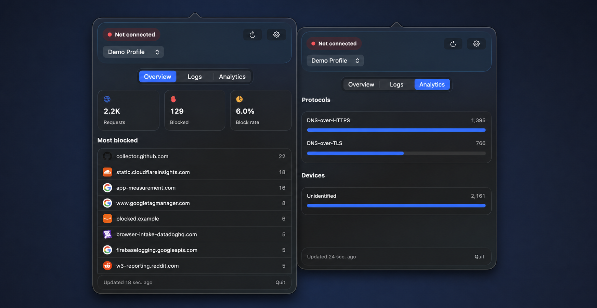

# NextDNS Stats

A native, menu-bar-only macOS app for checking whether this Mac currently uses NextDNS and viewing account activity without keeping the NextDNS dashboard open.



## What it shows

- Current NextDNS connection status and DNS protocol
- Multiple account profiles with instant switching
- Total and blocked requests over the previous 24 hours
- Block rate and the ten most-blocked domains
- Recent DNS logs, including device and block reason, with cursor-based “Load more” pagination
- Request breakdowns by protocol and device

The app refreshes when its popover opens unless the current snapshot is less than 30 seconds old, then polls every 30 seconds while it remains open. Closing the popover stops polling, and manual refresh always fetches immediately.

## Build and run

Requires macOS 14 or newer and Xcode 16 or newer.

```sh
./scripts/build-app.sh
open "build/NextDNS Stats.app"
```

To rebuild, replace the copy in Applications, preserve its stable Keychain identity, and relaunch it:

```sh
./scripts/install-app.sh
```

The first build using the stable signing requirement may ask for Keychain access once. Choose **Always Allow**; later rebuilds use the same designated requirement and should not prompt again.

The shield icon appears in the macOS menu bar. Open Settings from the popover, then paste the API key shown at the bottom of the [NextDNS account page](https://my.nextdns.io/account).

## Privacy and credentials

The API key is stored as a generic password in macOS Keychain under service `io.nextdns.stats`; it is never written to preferences or project files. Account data is requested directly from `https://api.nextdns.io`. Current DNS connectivity is checked independently through `https://test.nextdns.io`, so connection status works before an API key is configured.

Visible domain names are sent to `https://icons.duckduckgo.com` to retrieve favicons. Responses are cached on disk according to HTTP caching rules, and the UI uses a local monogram when an icon is unavailable.

Service domains that should use a different brand favicon are defined in the repository-root `IconDomainMappings.json`. The app fetches the file from GitHub when it starts, validates every entry, and retains compiled defaults for offline use. Entries match the listed hostname and all its subdomains, so mapping changes only require editing and pushing the JSON file—not rebuilding the app.

## Development

```sh
swift test
swift build
```

The client tests stub all HTTP traffic and cover profile discovery, analytics aggregation, logs, connection detection, API errors, profile switching, and refresh cancellation.
